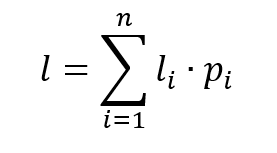
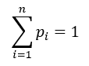

# Fano archiver

## Description

Archiver based on Fano algorithm. The Fano algorithm uses 
variable-length prefix codes: a frequently occurring byte of data 
is encoded with a shorter code, and a rare one with a longer code.

File data archiving occurs after the program builds a Fano code 
table (a unique code is selected for each unique byte) and then 
replaces each byte with its code. Unpacking goes this way: 
the program reads stored Fano code tree from the compressed file 
and recovers the data, mapping each code to its bytes.

## Implementation

The program is a CLI application that performs data compression / 
decompression procedure. 

Ensure that you have `gcc compiler` on board and use Makefile 
(for Linux) to perform the following actions:

To build the binary, run `make` (at the root of repo) \
To clean repo from the compiled objects, run `make clean`

Repository also has example files placed on `examples` folder for 
quick testing the functionality.

### Using

To run the program use next example:

`<fano-archiver> <src.file> <mode> <tgt.file>`

where\
`fano-archiver` is the name of the binary for particular 
platform\
`src.file` is the path to source file\
`mode` is the compress/decompress action, specified with `c` or 
`d` flags\
`tgt.file` is the path to target file (which will be created after 
program executing)

For example:
`./fano-archiver examples/parargaph.txt c compressed.txt`

## Theory. Example of how it works

All unique messages (in our case, unique bytes, or ASCII symbols) 
are written into a table in decreasing probability / amount.
Then messages in the table are split into two groups of approximately 
equal probability. According to this procedure, two edges emanate
from the root of code tree and the obtained probabilities are 
assigned to these edges as their weights. Code symbols `0` and `1` 
are assigned to the two formed vertices. 

Then, each of probability groups is again divided into two 
subgroups of approximately equal probability. In accordance with
this, two edges emanate from each vertex `0` and `1` with weights
equal to the probabilities of the subgroups, and the symbols
`00` and `01`, `10` and `11` are assigned to the newly formed 
vertices. 

As a result of repeated procedure of dividing the probabilities 
and forming the vertices, sooner or later, weight assigned to the 
edge will be the probability of each of the messages. In this case,
the newly formed vertex turns out to be a leaf of the tree, since 
the process of dividing the probabilities for it is complete. The
coding problem are solved when leaves are formed on all branches 
of the binary code tree.

The **coding price** (average length of a codeword) is a criterion for 
the degree of coding optimality. It is calculated as follows:

    

where `l` is the current length of a codeword and `p` is the current 
probability (current message amount / total amount), where

    

## Implementation complexity analysis

### Compression

1. Filling the table with unique bytes and their amount: `~O(n)`, 
where `n` is the number of bytes in source file
2. Sorting in descending order bytes in the table: `~O(m^2)`, 
where `m` is the number of unique bytes in the table
3. Formation of codes in the table (on this stage, the Fano
tree key is built): `~O(m^2)`
4. Compressing the source file byte sequence: `~O(m*n)`

### Decompression
1. Reading the tree key from file: `~O(n)`
2. Binary tree building: `~O(m^2)`
3. Decompressing byte sequence: `~O(n*log(n))`
